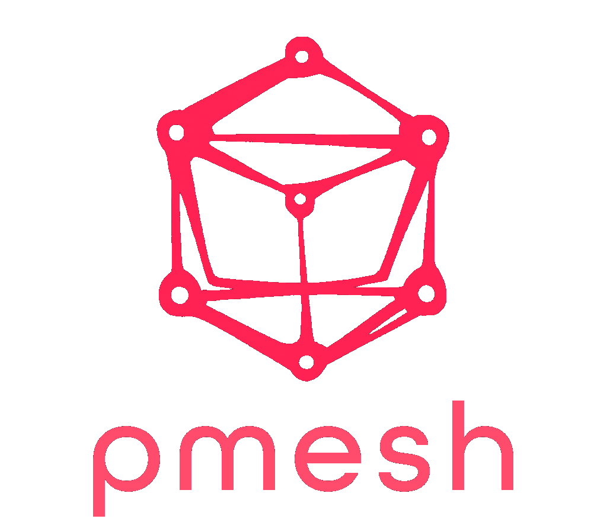

<p align="center">
  
</p>
<p align="center">
   <a href="https://github.com/pme-sh/pmesh/actions/workflows/build.yml">
      
   </a>
   <a href="https://github.com/pme-sh/pmesh/actions/workflows/release.yml">
      
   </a>
</p>

[pmesh](https://pme.sh) is an all-in-one service manager, reverse proxy, and enterprise service bus. It is designed to be a simple and powerful all-in-one replacement for a wide variety of tools commonly deployed in web services. It is currently in alpha and under active development.

You can find the documentation at [pme.sh](https://pme.sh), although it is still a work in progress.

## Features

pmesh is designed to streamline what was previously a complex web of separate tools into a single, efficient framework

- **As a Reverse Proxy**: As an alternative to Nginx, HAProxy, and similar tools, pmesh delivers lightning-fast SSL termination, routing, rate-limiting, and load balancing, handling over 200k requests per second on a 12-core server. Beyond the basics, pmesh offers GeoIP identification, automatic TLS certificate management, URL signing, and even integrating webhooks into a message queue, all without breaking a sweat.

- **For Service Management**: Taking on the role of systemd, pm2, and similar tools, pmesh simplifies service lifecycle management. It ensures services are always running, scales them according to demand, and provides a robust API for management tasks like rolling updates, health checks, and more. Its ability to support zero-downtime hot-swaps and built-in compatibility with a wide range of languages and frameworks means you spend less time on configuration and more on development.

- **In Service Discovery**: Like consul and etcd, pmesh automates the discovery and registration of services, directing traffic based on service health and other metrics. It facilitates inter-service communication with straightforward APIs, making setup and maintenance a breeze.

- **As a Message Bus**: Integrating the functionality of systems like RabbitMQ and Kafka, pmesh offers a high-performance, low-latency messaging system for inter-service communication and event-driven architectures. Embedded within pmesh is a fork of NATS.io, a high-performance messaging system, designed for high-throughput, low-latency messaging.

- **As a KV and Object Store**: pmesh offers a high-availability key-value store and object storage, with features like auto-replication and sharding, simplifying data management and storage, making your services more resilient and responsive.

- **With Topology Management**: Written with distibuted systems in mind, pmesh is designed to allow any number of pmesh instances to form a self-discovering, self-healing, and optimizing topology. Making it easy to manage and scale your infrastructure all with a single `pmesh join pmtp://...` command. No impossible to maintain configuration of servers, no manual assignment of routes and regions, no need to restart any service. It automates local DNS management, issues TLS certificates transparently, and ensures security with mutual authentication between nodes using client certificates.

- **Through Distributed Logging**: pmesh captures the logs from all services into a centralized system you can query, search, and even tail in real-time across your entire infrastructure. For any request, pmesh assigns a unique Ray ID, allowing you to track it across all services, making it easy to debug and monitor your infrastructure.

## Installation

The unzip package is required to install pmesh. Use `sudo apt install unzip` to install unzip package.

```sh
curl -fsSL https://get.pme.sh/install.sh | bash
# to install a specific version
curl -fsSL https://get.pme.sh/install.sh | bash -s "v0.1.5"
```

## Building from source

Make sure you have the latest version of Go installed and run:

```sh
go install get.pme.sh/pmesh@latest
```

## Usage

```
Usage:
  pmesh [command]

Logs:
  raytrace    Find logs by ray ID
  tail        Tail logs

Management:
  reload      Reloads the manifest, restarts all services
  shutdown    Shuts down the pmesh node

Service:
  ls          List services
  rebuild     Invalidates build cache and restarts service
  restart     Restart service
  stop        Stops service
  view        Show service details

Configuration:
  get         Get the pmesh node configuration
  get-seed    Get the seed URL
  set         Set the pmesh node configuration
  setup       Run the setup utility

Daemon:
  go          Start the pmesh node with a manifest
  preview     Previews the rendered manifest

Additional Commands:
  completion  Generate the autocompletion script for the specified shell
  create      Create a new manifest
  help        Help about any command

Flags:
  -B, --bind string             Bind address for public connections (default "0.0.0.0")
  -C, --cwd string              Sets the working directory before running the command
  -D, --dumb                    Disable interactive prompts and complex ui
  -E, --env string              Environment name, used for running multiple instances of pmesh
  -h, --help                    help for pmesh
  -H, --http int                Listen port for public HTTP (default 80)
  -S, --https int               Listen port for public HTTPS (default 443)
      --internal-port int       Internal port (default 8443)
  -L, --local-bind string       Bind address for local connections (default "127.0.0.1")
      --subnet-dialer string    Dialer subnet (default "127.2.0.0/16")
      --subnet-service string   Service subnet (default "127.1.0.0/16")
  -R, --url string              Specifies the node URL for the command if relevant
  -V, --verbose                 Enable verbose logging

Use "pmesh [command] --help" for more information about a command.
```
